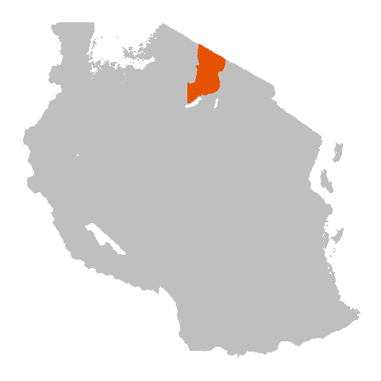

<ol class="breadcrumb" style="background-color:white;">
  <li class="breadcrumb-item"><a href="index.html">Home</a></li>
  <li class="breadcrumb-item active">Project Information</li>
</ol>

# Project Information

 

We carry out epidemiological and implementation research on rabies and its prevention and control in the Ngorongoro District of Mara region in Northwest Tanzania. We have a long-term contact tracing study ongoing in Ngorongoro that began in 2002.  
  
Since the study began, we have traced `r format(ngor_overview$n_suspect_animal, big.mark=",")` probable animal cases and `r format(ngor_overview$n_suspect_human, big.mark=",")` probable human exposures in Ngorongoro District. 

Full details of our publications are on google scholar. Links to the most relevant publications from our research in Ngorongoro are available [here](Ngor_publications.html), and links to our other projects on rabies can be found on our <a href="https://rabiesresearch.shinyapps.io/shiny_hub/", target="blank">hub</a>.

 

Our work is generously supported by a range of organizations. If you would like more information, we can be contacted following the links provided at the top-right of the page.    

  

