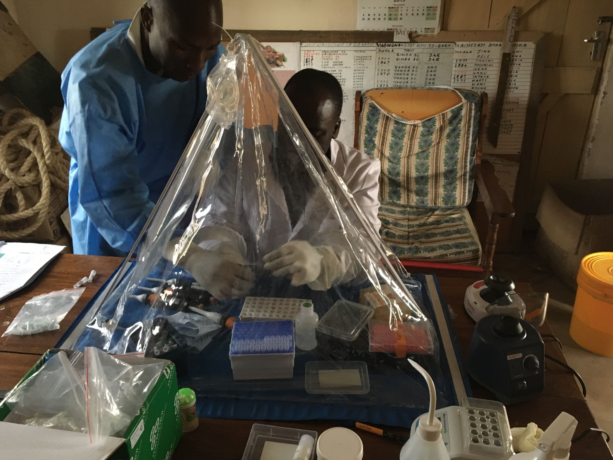

<ol class="breadcrumb" style="background-color:white;">
  <li class="breadcrumb-item"><a href="index.html">Home</a></li>
  <li class="breadcrumb-item active">Rabies Epidemiology</li>
</ol>

# Rabies Epidemiology  
  
Rabies incidence has been estimated through exhaustive contact tracing activities in Serengeti District since 2002. Contact tracing involves identifying probable animal Rabies cases and probable human Rabies exposures, and interviewing those connected to confirm status. A tissue sample is also taken from the deceased animal if suitable, for subsequent testing: a rapid diagnostic kit is used in-situ, with full laboratory test and genetic sequencing completed later.  
  
[Click here](data_epi.html) to see our epidemiology data, including Rabies incidence over time, and maps of probable and lab-confirmed animal Rabies cases.  
  

