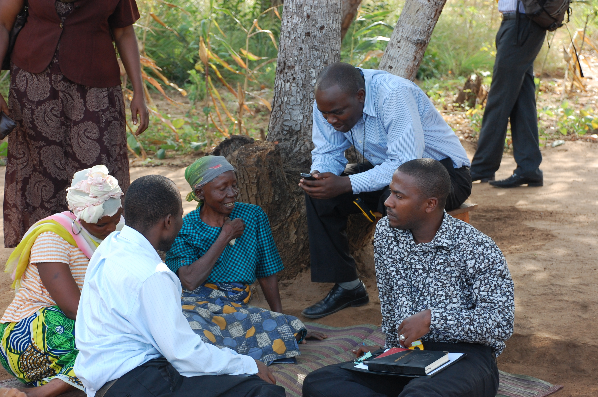

 

In Tanzania, we carry out epidemiological and implementation research on rabies and its prevention and control across different parts of the country. This work has also contributed to multi-country and global studies to inform policy for rabies prevention and control.

This page displays data from our long-term contact tracing project in Ngorongoro District.  
  
If you would like to explore our research in other parts of Tanzania or return to our central hub, please use the globe icon in the top right.    

 

